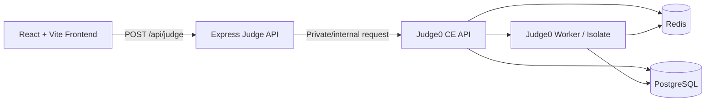

<div align="center">

# Online Judge Pro

### A modern, stateless online judge powered by Judge0 CE

Submit source code, upload hundreds of testcases, and receive detailed results through a polished web interface.

[](https://react.dev/)
[](https://vite.dev/)
[](https://nodejs.org/)
[](https://expressjs.com/)
[](https://judge0.com/)
[](https://docs.docker.com/compose/)

[Live Demo](https://haihttt974.github.io/online-judge-starter/) |
[Backend Health](https://online-judge-starter.onrender.com/api/health) |
[Report an Issue](https://github.com/haihttt974/online-judge-starter/issues)

</div>

---

## Overview

Online Judge Pro is a stateless judging platform designed for fast local evaluation and straightforward deployment. The React frontend sends source code and testcase pairs to an Express API. The API validates each request, delegates isolated execution to Judge0 CE, normalizes the result, and returns detailed feedback immediately.

The application does not store submissions and does not require its own database. PostgreSQL and Redis are used internally by Judge0 only.

### Highlights

- Modern responsive interface with Monaco Editor, dark mode, multilingual UI, and detailed result views.
- Upload individual testcase files or recursively scan an entire testcase folder.
- Pair testcase files automatically using the `N.IN` and `N.OUT` naming convention.
- Judge up to `500` testcases per request with configurable limits.
- Compile-once execution for C, C++, Pascal, C#, and Python in self-hosted Compose environments.
- Detailed statuses, output previews, compile errors, runtime errors, execution time, and memory usage.
- Stateless Express API with request, file, source-code, and output limits.
- Local development, standalone cloud deployment, and self-hosted production deployment workflows.

## Supported Languages

| Language | Judge0 default ID | Local compile-once | Default time | Default memory |
|---|---:|:---:|---:|---:|
| C | `50` | Yes | 2000 ms | 256 MB |
| C++ | `54` | Yes | 1000 ms | 256 MB |
| Python 3 | `71` | Yes | 5000 ms | 512 MB |
| Java | `62` | No | 3000 ms | 512 MB |
| C# | `51` | Yes | 3000 ms | 512 MB |
| Pascal | `67` | Yes | 2000 ms | 256 MB |

Judge0 language IDs depend on the deployed Judge0 image. Override them with `JUDGE0_LANGUAGE_ID_<LANGUAGE>` when necessary.

## Architecture



### Security Boundaries

- The browser never communicates with Judge0 directly.
- The backend never executes user code with Node.js, `child_process`, or host compilers.
- Judge0 runs submissions inside isolated containers with networking disabled.
- The self-hosted Judge0 port is not published to the host or public internet.
- Source code, testcase input, expected output, and response sizes are bounded.

## Quick Start

### Requirements

- Docker Desktop or Docker Engine with Docker Compose
- At least 4 GB of available memory recommended

### Start the Full Development Stack

```bash
git clone https://github.com/haihttt974/online-judge-starter.git
cd online-judge-starter
docker compose up --build
```

Open:

- Web interface: [http://localhost:8080](http://localhost:8080)
- API health: [http://localhost:8080/api/health](http://localhost:8080/api/health)

The first startup may take several minutes while Docker downloads Judge0 images and initializes PostgreSQL.

> Running only `cd client && npm run dev` starts the frontend without the backend and Judge0. Judging requires the full stack.

### Stop the Stack

```bash
docker compose down
```

## Testcase Format

Upload matching `.IN` and `.OUT` files:

```text
testcases/
|-- 1.IN
|-- 1.OUT
|-- 2.IN
|-- 2.OUT
`-- ...
```

The frontend can scan nested folders recursively. Files are paired only when the numeric filename and parent folder match.

| Limit | Default |
|---|---:|
| Testcases per request | `500` in Compose |
| Size per `.IN` or `.OUT` file | `2 MB` |
| Source code size | `64 KB` |
| Response preview per field | `16 KB` |

## Judging Strategy

### Self-Hosted Docker Compose

For C, C++, Pascal, C#, and Python, the backend creates one Judge0 multi-file submission:

1. Package the source code, run script, optional compile script, and every testcase input.
2. Compile the source once.
3. Execute every testcase using the same compiled program.
4. Return an ordered result for each testcase.

Java uses the fallback path because Judge0 1.13.1 JVM execution is not reliable on Docker Desktop with cgroup v2.

### Standalone Deployment

The standalone `Dockerfile`, used by services such as Render, defaults to the public Judge0 CE endpoint and disables compile-once mode. This keeps the deployed demo functional without requiring privileged Judge0 workers inside the hosting platform.

## Deployment

### Deployment Matrix

| Target | Frontend | Backend | Judge0 | Recommended use |
|---|---|---|---|---|
| Development Compose | Vite on `:8080` | Express on `:3000` | Self-hosted | Local development |
| Standalone Dockerfile | Express serves built frontend | Same container | Public `ce.judge0.com` | Demo / Render |
| Production Compose | Express serves built frontend | Same container | Private self-hosted stack | VPS / production |
| GitHub Pages | Static frontend | External URL via `VITE_API_URL` | Managed by backend | Public frontend |

### Standalone Cloud Deployment

The root `Dockerfile` builds the frontend and starts the Express backend. Its defaults are:

```text
JUDGE0_URL=https://ce.judge0.com
JUDGE0_COMPILE_ONCE=false
JUDGE0_WAIT_ON_START=true
```

The public Judge0 service is appropriate for demos, but it may have rate limits or availability constraints.

### Self-Hosted Production

Create a production environment file:

```bash
cp .env.example .env
```

Set strong values:

```dotenv
JUDGE0_POSTGRES_PASSWORD=replace-with-a-strong-password
JUDGE0_REDIS_PASSWORD=replace-with-a-strong-password
JUDGE0_IMAGE=judge0/judge0:latest
```

Start production:

```bash
docker compose -f docker-compose.prod.yml up -d --build
```

Production Compose publishes the app on port `80`. Judge0, Redis, and PostgreSQL remain on the private Docker network.

### GitHub Pages

GitHub Pages hosts static files only. The frontend must point to a live backend:

```dotenv
VITE_API_URL=https://your-backend.example.com
```

Deploy:

```bash
cd client
set VITE_DEPLOY_TARGET=gh-pages
npm run deploy
```

On macOS or Linux, use `export VITE_DEPLOY_TARGET=gh-pages`.

## API Reference

### Health Check

```http
GET /api/health
```

Healthy response:

```json
{
  "ok": true,
  "judgeReady": true,
  "message": "Judge server is running"
}
```

### Judge Submission

```http
POST /api/judge
```

The frontend sends `multipart/form-data`:

| Field | Description |
|---|---|
| `language` | `c`, `cpp`, `python`, `java`, `csharp`, or `pascal` |
| `code` | Source code |
| `files` | Paired testcase files such as `1.IN` and `1.OUT` |

The API also accepts JSON:

```bash
curl -X POST http://localhost:8080/api/judge \
  -H "Content-Type: application/json" \
  -d '{
    "language": "cpp",
    "sourceCode": "#include <iostream>\nint main(){int a,b;std::cin>>a>>b;std::cout<<a+b;}",
    "testcases": [
      {
        "input": "1 2\n",
        "expectedOutput": "3\n"
      }
    ]
  }'
```

Example response:

```json
{
  "status": "AC",
  "normalizedStatus": "accepted",
  "totalTests": 1,
  "executedTests": 1,
  "passedTests": 1,
  "score": 100,
  "results": [
    {
      "index": 1,
      "status": "AC",
      "passed": true,
      "actualOutput": "3"
    }
  ]
}
```

### Result Statuses

| Status | Meaning |
|---|---|
| `AC` | Accepted |
| `WA` | Wrong Answer |
| `PE` | Presentation Error / whitespace difference |
| `TLE` | Time Limit Exceeded |
| `MLE` | Memory Limit Exceeded |
| `OLE` | Output Limit Exceeded |
| `CE` | Compilation Error |
| `ER` | Runtime Error |
| `SE` | Judge Service / Internal Error |

## Configuration

The full configuration template is available in [`.env.example`](.env.example).

### Core Variables

| Variable | Purpose | Default |
|---|---|---|
| `JUDGE0_URL` | Primary Judge0 API URL | `http://judge0-server:2358` |
| `JUDGE0_URLS` | Comma-separated Judge0 fallback URLs | Empty |
| `JUDGE0_WAIT_ON_START` | Check Judge0 before serving traffic | `true` |
| `JUDGE0_REQUEST_TIMEOUT_MS` | Judge0 request timeout | `60000` |
| `JUDGE0_MAX_TESTCASES` | Maximum testcase pairs per request | `50`, Compose uses `500` |
| `JUDGE0_COMPILE_ONCE` | Enable one multi-file submission | `false`, Compose uses `true` |
| `JUDGE0_COMPILE_ONCE_LANGUAGES` | Languages using compile-once | `c,cpp,pascal,csharp,python` |
| `JUDGE0_PER_PROCESS_LIMITS` | cgroup v2 compatibility mode | `false`, dev Compose uses `true` |
| `MAX_OUTPUT_BYTES` | Maximum output retained by backend | `1048576` |

### Resource Variables

| Variable | Purpose |
|---|---|
| `JUDGE0_CPU_TIME_LIMIT` | CPU time limit override |
| `JUDGE0_WALL_TIME_LIMIT` | Wall-clock time limit override |
| `JUDGE0_MEMORY_LIMIT` | Submission memory limit in KB |
| `JUDGE0_MAX_MEMORY_LIMIT` | Maximum Judge0 memory limit in KB |
| `JUDGE0_MAX_SOURCE_CODE_SIZE` | Maximum source code size |
| `JUDGE0_MAX_STDIN_SIZE` | Maximum input file size |
| `JUDGE0_MAX_EXPECTED_OUTPUT_SIZE` | Maximum expected-output file size |
| `JUDGE_MAX_RESPONSE_FIELD_BYTES` | Maximum returned content per result field |

## Project Structure

```text
online-judge-starter/
|-- client/                         # React + Vite frontend
|   `-- src/App.jsx                 # Main interface and submission workflow
|-- server/
|   |-- src/server.js               # Express routes and health checks
|   |-- src/judge.js                # Validation and judging orchestration
|   |-- src/services/               # Judge0 client and compile-once helpers
|   `-- test/                       # Node.js backend tests
|-- Dockerfile                      # Standalone deployment image
|-- docker-compose.yml              # Development stack
|-- docker-compose.prod.yml         # Self-hosted production stack
`-- .env.example                    # Production configuration template
```

## Testing

Run backend tests:

```bash
cd server
npm test
```

Build the frontend:

```bash
cd client
npm run build
```

Validate Compose:

```bash
docker compose config
docker compose -f docker-compose.prod.yml config
```

## Troubleshooting

### `Judge service unavailable`

Check readiness:

```bash
curl http://localhost:8080/api/health
docker compose ps
docker compose logs --tail 100 judge-app judge0-server judge0-worker
```

For GitHub Pages, verify that `VITE_API_URL` points to a live backend. For standalone cloud deployment, verify that the backend can reach its configured `JUDGE0_URL`.

### Judge0 Returns Internal Error on Docker Desktop

Ensure development Compose sets:

```dotenv
JUDGE0_PER_PROCESS_LIMITS=true
```

### Production Password Authentication Fails

The PostgreSQL volume may have been initialized with an older password. Ensure the password stored in the volume matches `JUDGE0_POSTGRES_PASSWORD`, or recreate the volume only when data loss is acceptable.

## Production Notes

- Pin `JUDGE0_IMAGE` after verifying supported language IDs.
- Add authentication and rate limiting before exposing the API publicly.
- Keep Judge0, PostgreSQL, and Redis on a private network.
- Use strong PostgreSQL and Redis passwords.
- Monitor queue depth, worker health, API latency, and resource consumption.
- Prefer self-hosted production Compose over the public Judge0 endpoint for reliability and control.

---

<div align="center">

Built with React, Express, Judge0 CE, and Docker.

</div>
